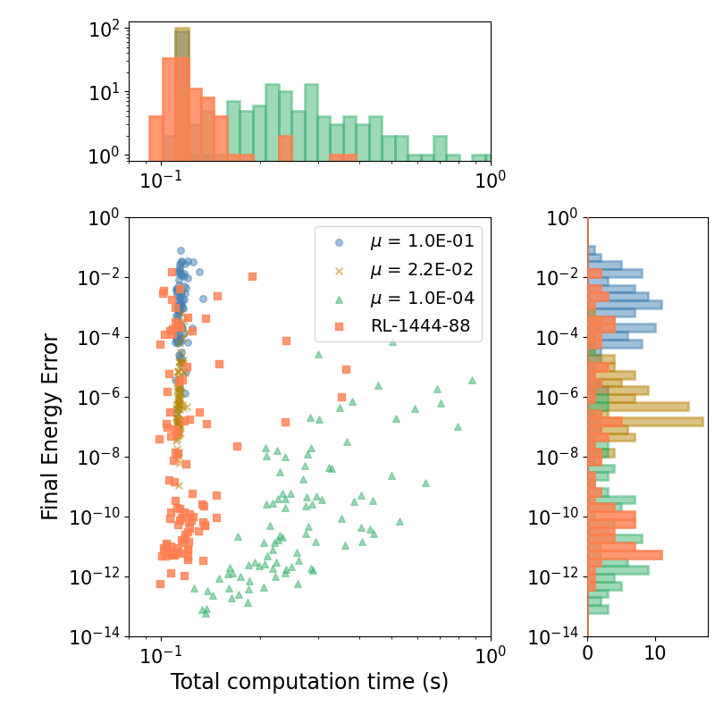

--- 
# Computational Astrophysics and Machine Learning
---

### Reinforcement Learning
#### Reinforcement Learning for the Determination of the Bridge Time Step in Cluster Dynamics Simulations
The three-body problem is famously complex. As there is no analytical solution to predict the future state of the system, we rely on numerical simulations. These simulations are approximations, and their accuracy depends on certain simulation parameters. An important one is the time-step size. The smaller this value, the more the integration approximates a continuous solution, and the more accurate the simulation will be. However, reducing the time-step size leads to a larger computational cost of the simulation. 

{: height="60" } 
{: height="60" } 

We want to balance accuracy and computational cost to achieve efficient simulations that still allow us to extract scientific conclusions. To do that, we develop a reinforcement learning algorithm that automatically selects it for you. By doing so, we also allow this time-step parameter to change and adapt to the needs of the simulation to keep the accuracy requirements. Our method achieves better results than any of the current methods.

The code is publicly available at [Github link](https://github.com/veronicasaz/ThreeBodyProblem_astronomy) 
See [Publication](1_publications.md)

#### Reinforcement Learning for Adaptive Time-Stepping in the Chaotic Gravitational Three-Body Problem
We introduced the idea of using reinforcement learning algorithms to choose essential simulation parameters automatically. Here, we extend the idea to a more complex case, including multi-scale astrophysical systems. We create a method that balances accuracy and computation time while achieving better results than the current methods. Additionally, we ensure the robustness of the method for long simulations by creating a hybrid method that checks the quality of the reinforcement learning choices. 

If you find it interesting, take a look at the [Publication](1_publications.md).

Also, the code and trained models are publicly available at [Github link](https://github.com/veronicasaz/RL_bridgedCluster).

{: height="60" } 
{: height="150" } 

### Physics-informed Neural Networks
#### A hybrid approach for solving the gravitational N-body problem with Artificial Neural Networks (2021-2022)
The numerical integration of a system of _N_-bodies, the calculation of the mutual forces between bodies can drive the computation time. The computational complexity scales quadratically with the number of bodies. This means that simulating a large system is... expensive. 

Machine Learning can help with that. If instead of calculating these forces, we use neural networks to predict the total acceleration, we can save a lot of computing power. Physics-aware neural networks incorporate some of our physics knowledge into the neural network. In this case, we choose Hamiltonian Neural Networks (HNNs) and apply them to the integration of a planetary system with a large number of asteroids. We find that there are advantages and challenges to the application of HNNs to complex cases such as the gravitational _N_-body problem.

See [Publication](1_publications.md)

{: height="150" } 
{: height="150" } 

---
# Optimization and Astrodynamics
---

### Alpbach Summer School: Design of a space mission to a gas Giant

The Saturnian system has been the target of four previous space missions and has generated high scientific interest due to its dynamic atmospheric properties and its many moons, some of which are key targets for the search for habitability. The SIREN mission is designed to study these environments, focusing on three main science goals. Firstly, the mission aims to study Saturn’s atmospheric composition to further understand its formation and evolution. Secondly, it aims to study the Saturnian ring and moon formation and evolution as a proxy for accretion processes in protoplanetary discs. Lastly, the mission will study what chemical processes shape Enceladus' potentially habitable subsurface and surface environment. 

{: height="150" } 

The orbiter will perform multiple flybys of Enceladus at different altitudes crossing the plume to unambiguously characterise its chemical composition as a probe of this moon’s pristine interior material. After that, the orbiter will perform close observations of the A and B rings. The Saturn atmospheric entry probe (ARGO) will carry out measurements during a 90-minute descent to characterize the atmospheric composition down to an altitude of 20 bar. 

See the [Presentation slides](Alpbach_presentation.pdf) and [Report](Alpbach_report.pdf).

### Post Alpbach: Concurrent Engineering design of a mission to Neptune

As a continuation of the Alpbach workshop, we continued the development of a space mission, this time to Neptune and its Moon, Triton. 

This mission requires a complex trajectory, including a retrograde orbit around Neptune that allows for the mapping of Neptune's atmosphere and magnetic fields. Then, the spacecraft is inserted into a Triton orbit to map its surface to the last details. It is important to take into account the current regulations for spacecraft disposal at the end of the mission. 

Publication coming soon!

### Master's thesis: Low-Thrust Interplanetary Trajectory Optimization Using Pre-Trained Artificial Neural Network Surrogates (2020 - 2021)
{: height="250" } 

The use of low-thrust propulsion for interplanetary missions requires the implementation of new methods for the preliminary design of their trajectories. This thesis proposes a method using the Monotonic Basin Hopping global optimization algorithm to find feasible trajectories with optimum use of the mass of fuel for the case in which the trajectory is modeled using the Sims-Flanagan transcription method. Due to the large computational time required to find the global optimum, Artificial Neural Networks have been used to predict the objective value and feasibility terms of the local minimum. Therefore, the procedure to set up a working regression Artificial Neural Network is studied as well as its transferability to predict values outside the trained limits and for different missions. In addition to this, the use of pre-training is analyzed to improve the performance of the network without increasing the size of the training database.

The scripts for this project can be found in [Link to github](https://github.com/veronicasaz/MasterThesis).

[Link to thesis](https://repository.tudelft.nl/record/uuid:09c8d317-4f4f-4cb9-9778-bc77b1dd8e59)

{: width="250" } {: width="250" } 

### Optimization algorithm comparison of a spacecraft trajectory to Mars (2020)
A determining factor in the success of an interplanetary mission is the calculation of the mass of
fuel that is needed. In order to increase the payload mass that can be carried, the mass of fuel
must be reduced.

I compared the efficiency of different optimization methods to reduce the mass of fuel required for the transfer while ensuring the constraints are met. 

{: width="500" }

See the full report with the explanation of the method and a comparison of optimization methods for a simplified version of the problem and a more complex one in [Report](docs/optimization_report.pdf).

### Astrodynamics libraries (2018 - 2020)
My first big Python project was a set of astrodynamics libraries to be used to solve a multitude of problems. It includes scripts for basic astrodynamics calculations, a trajectory class that calculates all orbit parameters from a set of inputs, and numerical integration capabilities. Additionally, the scripts include simple plotting tools. 

[Github link](https://github.com/veronicasaz/AstrodynamicsScripts)

Additionally, I programmed a set of optimization algorithms that can be used to solve trajectory optimization problems. Among those, Evolutionary Algorithms and Monotonic Basin Hopping are some of my favourite. So feel free to also check out my work on a comparison between optimization algorithms for a trajectory to Mars. 

---
# Other projects
---
### Python modelling of an offshore turbine system (2020)

---
# Fun Projects
---

### How would you solve a puzzle with discrete optimization?
I have this wooden puzzle in which pieces of different shapes fit to form a perfect square. Every time a friend comes to my house and breaks it down to try to solve it and fails, I have to spend hours putting it back together. 

So what if I could program an optimization algorithm to solve it for me? This will be my first attempt at discrete optimization, so any feedback is welcome. Results coming soon. 

### Couple's Secret Santa (Christmas 2024)
Ok, Christmas is closing in and your family wants to run a Secret Santa. But all the online programs are made for individual choices. However, your 80-year-old granpa would be a terrible gifter for your 18-year-old cousin, so it makes sense to pair everybody in the family. Let's call it team-Secret Santa. Each pair gets two names to buy presents for, but those people do not necessarily have to be a pair themselves.

The results are saved in individual files that can be sent to each pair without the person running the code peaking in.  

Currently the code is very simple and just runs until the constraints are made. 

