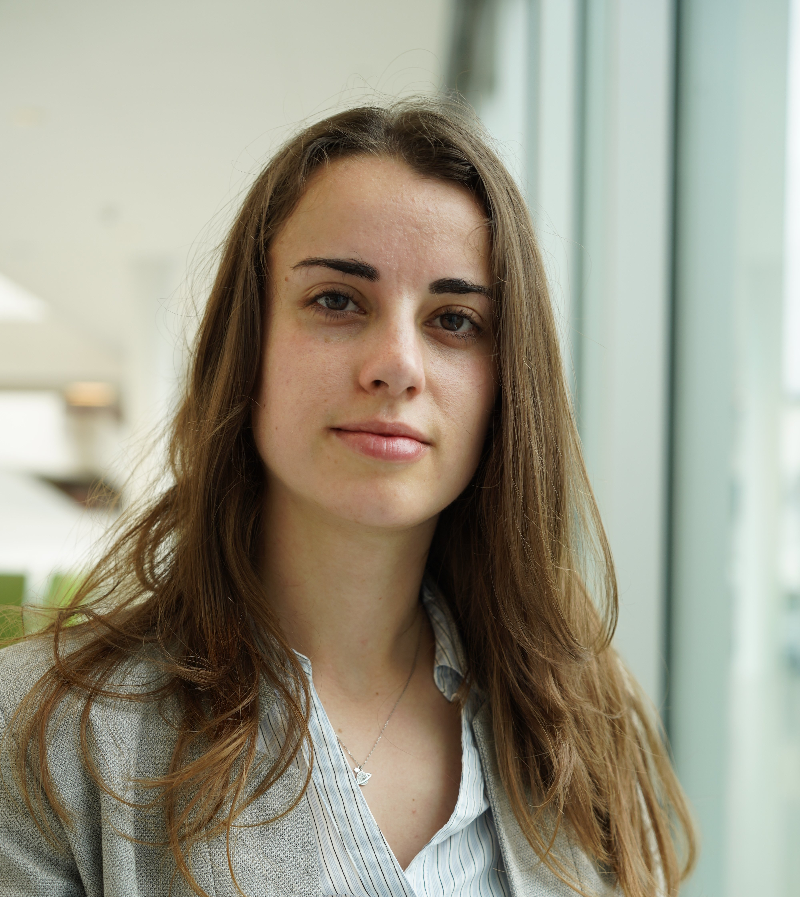

{: width="150" } 

My name is Veronica and I am an aerospace Engineer with (almost) a Ph.D. in computational astrophysics. I have specialized in astrodynamics, numerical simulations, mathematical optimization, and machine learning, but my range of interests is broad so I am also very interested in chaos, complex systems, earth observation and nature, photography, technical drawing, and fantasy novels. 

I enjoy scientific programming for complex problems to very unserious applications (check my algorithm for a couple's Secret Santa). I like getting a deep understanding of a problem and extracting information from data, and then plotting it in the most intuitive ways. Inkscape has also become an essential tool for me to make schematics of the problem and ensure that everybody is capable of following my thought process. 

Feel free to get in touch if you would like to know more about my work or any of my projects!

[Curriculum Vitae](docs/CV.pdf)

